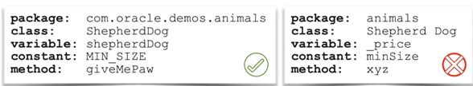
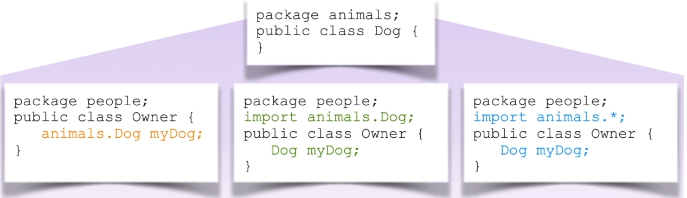
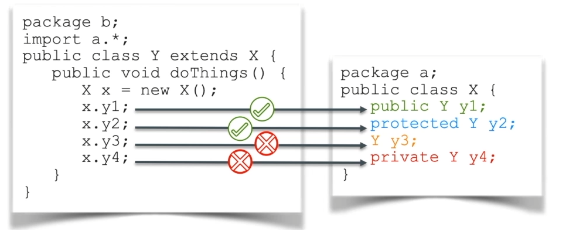
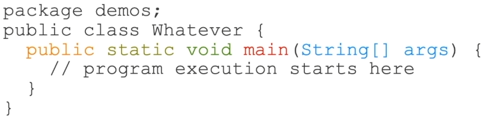

# ORACLE_JAVA_CERTIFICATION

# Introduction Part 1

JAVA SE est la base suivie de :

Java EE : le plus (haut niveau) complet pour les entreprises

JAVA MP = Micro profil (ex micro service)

JAVA ME = electronic device

JAVA CARD = exemple carte de crédit

Les fichiers avec l'extension .java contiennent le **Code source**.

Pour compiler du code java cad file.java faire la commande

```cmd
javac
```

Le fichier .java génèrera le fichier .class

Les fichiers avec l'extension .class contiennent le **Code source compilé** dis binary code

# Introduction Part 2

On crée des classes, dans lesquelles se trouvent les déclarations de variables, des opérations, algorithme, méthodes ...
Toutes les actions que peuvent réaliser une classe.

Un objet est une instance spécifique de classe. Chaque objet pourra avoir exactement la structure des attributs et des
comportements définis par la classe.

Exemple:

```java
class Person {
    void play() {
        Dog dog = new Dog();
        Dog.name = "Rex";
        Ball ball = new Ball();
        Dog.fetch(ball);
    }
}

class Dog {
    String name;

    Fetch(Ball ball) {
        Ball.find();
        Ball.chew();
    }
}
```

**L’héritage** permet à une class spécifiques d’hériter d’attributs et méthode décrite dans la classe mère. Les types
parents sont appelées **superclass**. Les sous-types sont appelés des **sous-classes**. L’idée est de faire du code
réutilisable par un ensemble de classe.

Exemple :

```java
class Animal extends OrganismeVivant {
    // generic attributes et comportements
}

class Dog extends Animal {
    //spécifique attributes et comportements
}


```

Un grand nombre de classes sont déjà utilisées par JDK. Exemples :

* Types de datas basics : **String, LocalDateTime, BigDecimal**.
* Pour manipuler des collections : **Enumeration, ArrayList, HashMap**.
* Pour gérer un comportement générique et effectuer des actions système : **System, Object, Class**.
* Pour exécuter des opérations sur les input et output : **FileInputStream, FileOutputStream**.
* Beaucoup d’autres API (Application Programming Interface) sont utilisées pour : accès base de données, gérer la
  concurrence, activer les communications réseau, exécuter des scripts, gestions des transactions, sécurité, connexion,
  construction d’interface graphique.

Documentations API JAVA :

https://docs.oracle.com/en/java/javase/16/docs/api/index.html

## Les mots clés JAVA, réserves.


## Java est sensible à la casse



# Introduction Part 3

## Règles de syntaxes

Toutes les instructions java doivent être terminées par le symbole ‘ ; ’.

Les blocs de code doivent être entourés de symboles { }.

L’indentation et les espaces n’ont aucun impact sur la compilation mais est nécessaire pour une bonne visibilité de
lecture de code.

Exemple:

```java
package com.oracle.demos.animals;

class Dog {
    void fetch() {
        while (ball == null) {
            keepLooking();
        }
    }

    void makeNoise() {
        if (ball != null) {
            dropBall();
        } else {
            bark();
        }
    }
}
```

## Définition d’une classe

Le nom de la classe est généralement représenté par un ou plusieurs noms. Exemples : Dog, SabreLaser, Person …

La classe doit être enregistrée dans un fichier portant le même nom que la classe et l'extension .java.

Les classes sont regroupées par packages.

Les packages sont représentés sous forme de dossiers dans lesquels les fichiers de classe sont enregistrés.

Le nom du package est généralement l'inverse du nom de domaine de votre entreprise, plus un système de dénomination
adopté au sein de votre entreprise. Exemple : com.oracle.demos ou org.acme.something

Les packages et le nom de la classe doivent former une combinaison unique.

Si le nom du package est absent la class sera mis dans un package par default. Attention cela n’est pas recommandé.

Exemple:

```java
package com.oracle.demos.animals;

class Dog {

}
```
La classe et package représentés ci-dessus devra être sauvegardé dans le dossier :**/somepath/com/oracle/demos/animals/Dog.java**


## Accéder aux classes à travers les packages




Les imports sont ignorés du compilateur.

## Utilisation de modificateur d’accès

* Public : Visible par toutes les autres class.
* Protected : Visible par les classes se trouvant dans le même package ou sous package.
* <default> Visible seulement dans la classe d’un même package.
* Private : Visible uniquement à l’intérieur de ça class.


Exemple :


 
## Création de la classe applicative Main

La class Main est le point d’entrée de notre programme. La machine virtuel Java recherchera et exécutera cette méthode en première.

Exemple :

