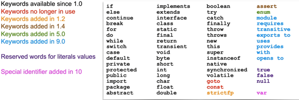

# ORACLE_JAVA_CERTIFICATION

# Introduction Part 1

JAVA SE est la base suivie de :

Java EE : le plus (haut niveau) complet pour les entreprises

JAVA MP = Micro profil (ex micro service)

JAVA ME = electronic device

JAVA CARD = exemple carte de crédit

Les fichier avec l'extension .java contiennent le **Code source**.

Pour compiler du code java cad file.java faire la commande

```cmd
javac
```

Le fichier .java génèrera le fichier .class


Les fichiers avec l'extension .class contiennent le **Code source compilé** dis binary code

# Introduction Part 2

On crée des classes, dans lesquelles se trouvent les déclarations de variables, des opérations, algorithme, méthodes ...
Toutes les actions que peuvent réaliser une classe.

Un objet est une instance spécifique de classe. Chaque objet pourra avoir exactement la structure des attributs et des
comportements définis par la classe.

Exemple:

```java
class Person {
    void play() {
        Dog dog = new Dog();
        Dog.name = "Rex";
        Ball ball = new Ball();
        Dog.fetch(ball);
    }
}

class Dog {
    String name;

    Fetch(Ball ball) {
        Ball.find();
        Ball.chew();
    }
}
```

**L’héritage** permet à une class spécifiques d’hériter d’attributs et méthode décrite dans la classe mère.
Les types parents sont appelées **superclass**. Les sous-types sont appelés des **sous-classes**.
L’idée est de faire du code réutilisable par un ensemble de classe.

Exemple :

```java
class Animal extends OrganismeVivant {
	// generic attributes et comportements
}

class Dog extends Animal {
	//specifique attributes et comportements
}


```

Un grand nombre de classes sont déjà utilisées par JDK.
Exemples :
* Types de datas basics : **String, LocalDateTime, BigDecimal**.
* Pour manipuler des collections : **Enumeration, ArrayList, HashMap**.
* Pour gérer un comportement générique et effectuer des actions système : **System, Object, Class**.
* Pour exécuter des opérations sur les input et output : **FileInputStream, FileOutputStream**.
* Beaucoup d’autres API (Application Programming Interface) sont utilisées pour : accès base de données, gérer la concurrence,
activer les communications réseau, exécuter des scripts, gestions des transactions, sécurité, connexion, construction d’interface graphique.

Documentations API JAVA :

https://docs.oracle.com/en/java/javase/16/docs/api/index.html

## Les mots clés JAVA, réserves.




# Introduction Part 3
